# Custom Linux ISO Creation

## Pre-requisites

1. Host Machine: Ubuntu
2. [Cubic ISO Creator](https://github.com/PJ-Singh-001/Cubic)
3. Standard Linux ISO
   1. Desktop Editions
      1. [Ubuntu 20.04 LTS](https://releases.ubuntu.com/focal/ubuntu-20.04.6-desktop-amd64.iso)
      2. [Ubuntu 22.04 LTS](https://releases.ubuntu.com/22.04.3/ubuntu-22.04.3-desktop-amd64.iso)
   2. Server Editions
      1. [Ubuntu 20.04 LTS](https://releases.ubuntu.com/focal/ubuntu-20.04.6-live-server-amd64.iso)
      2. [Ubuntu 22.04 LTS](https://releases.ubuntu.com/jammy/ubuntu-22.04.3-live-server-amd64.iso)
4. Logo and Wallpaper for Custom Linux e.g., **SkynetOS**


## Getting Started

## Install Cubic

```bash
sudo add-apt-repository ppa:cubic-wizard/release
sudo apt install --no-install-recommends cubic
```

## Launch Cubic

1. Create a new directory **SkynetOS** on **/home/user/Desktop/**
2. Search Cubic in Ubuntu Applications Menu and Open **Cubic**
3. Select Destination folder as **/home/user/Desktop/SkynetOS**
4. Click Next button on Right Top

   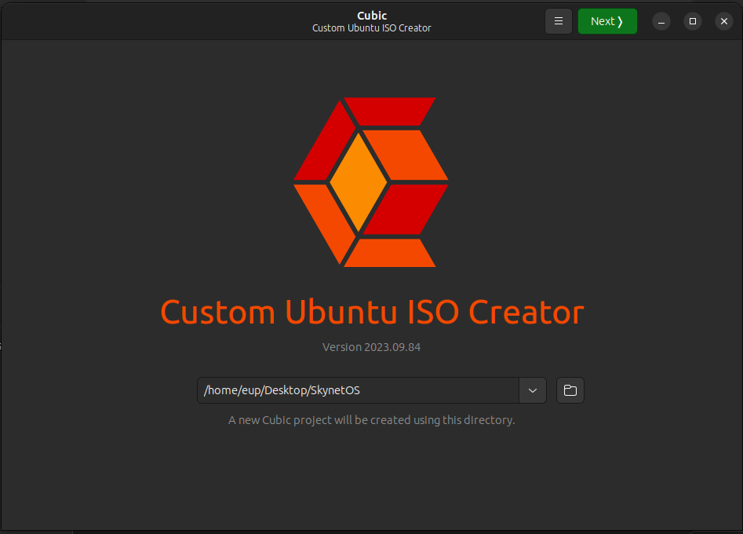

5. On the Left Pane
   1. Select Filename
   2. Select the **Source Linux ISO**, e.g., **Ubuntu 20.04 LTS.iso**
6. On the Right Pane, Change information according to requirements. E.g., 
   1. Change Version as **1.0**
   2. Change Filename to **Skynet.iso**
   3. Change Volume ID to **Skynet**
   4. Change Release to **Skynet Focal Fossa**
   5. Change Release URL to **http://www.skynet.com**
   6. Make sure **OS Release** is checked
7. Click Next button on Right Top

   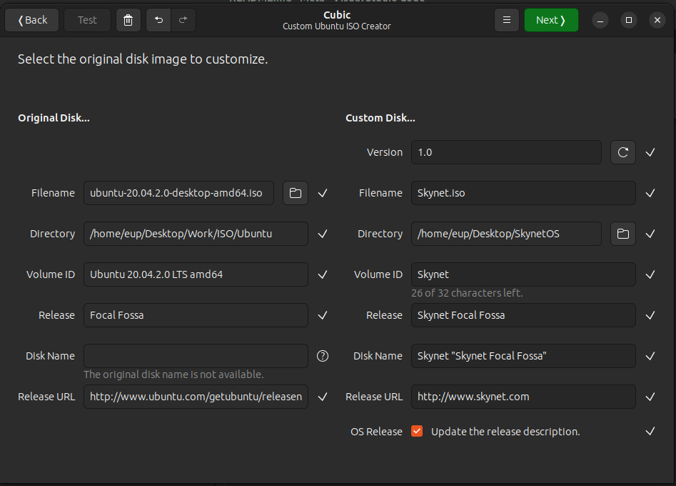

8. Wait until loading is complete and you are redirected to terminal
   
   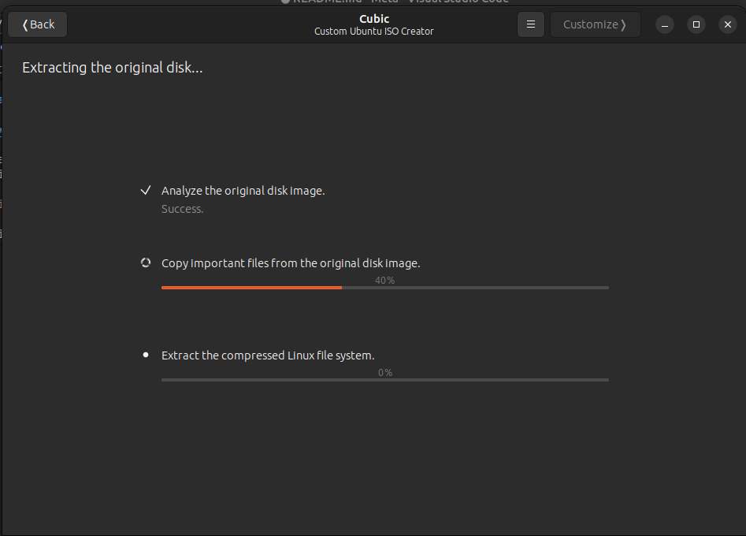

   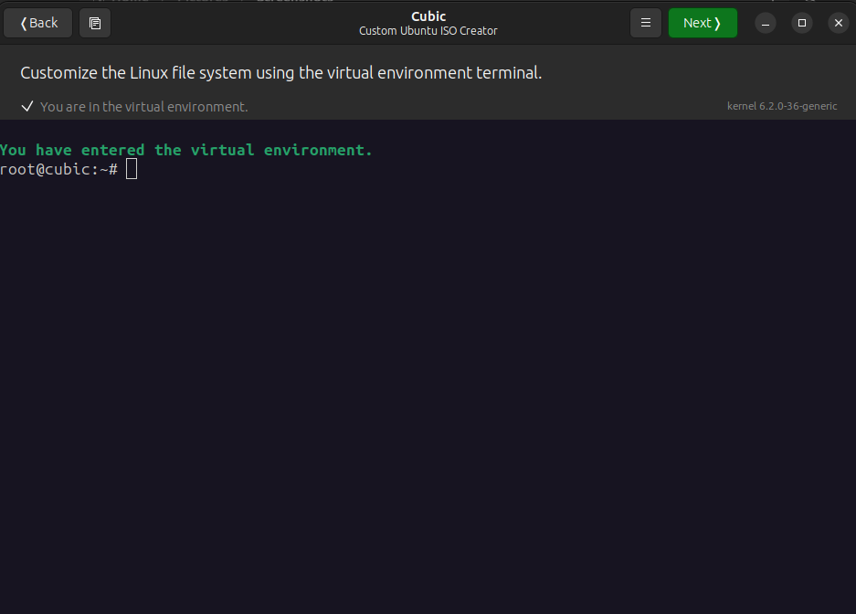

9. Update Ubuntu repositories
   1. Delete all existing repositories inside **/etc/apt/sources.list**
      ```bash
      echo "" > /etc/apt/sources.list
      ```
   2. Add new reporitories inside **/etc/apt/sources.list** according to Ubuntu **version e.g., 20.04 or 22.04**
      ```bash
      # For Ubuntu 20.04
      # https://gist.github.com/ishad0w/788555191c7037e249a439542c53e170
      deb http://archive.ubuntu.com/ubuntu/ focal main restricted universe multiverse
      deb-src http://archive.ubuntu.com/ubuntu/ focal main restricted universe multiverse
      deb http://archive.ubuntu.com/ubuntu/ focal-updates main restricted universe multiverse
      deb-src http://archive.ubuntu.com/ubuntu/ focal-updates main restricted universe multiverse
      deb http://archive.ubuntu.com/ubuntu/ focal-security main restricted universe multiverse
      deb-src http://archive.ubuntu.com/ubuntu/ focal-security main restricted universe multiverse
      deb http://archive.ubuntu.com/ubuntu/ focal-backports main restricted universe multiverse
      deb-src http://archive.ubuntu.com/ubuntu/ focal-backports main restricted universe multiverse
      deb http://archive.canonical.com/ubuntu focal partner
      deb-src http://archive.canonical.com/ubuntu focal partner
      ```
      ```bash
      # For Ubuntu 22.04
      # https://gist.github.com/hakerdefo/9c99e140f543b5089e32176fe8721f5f
      deb http://archive.ubuntu.com/ubuntu/ jammy main restricted universe multiverse
      deb http://archive.ubuntu.com/ubuntu/ jammy-updates main restricted universe multiverse
      deb http://archive.ubuntu.com/ubuntu/ jammy-security main restricted universe multiverse
      deb http://archive.ubuntu.com/ubuntu/ jammy-backports main restricted universe multiverse
      deb http://archive.canonical.com/ubuntu/ jammy partner
      ```
   3. Update Ubuntu
      ```bash
      sudo apt update
      ```

10. Install all required packages
      ```bash
      sudo apt install neofetch
      neofetch
      sudo apt install screen
      # You can install any package here
      ```
11. Install Suricate
      ```bash
      sudo add-apt-repository ppa:oisf/suricata-stable
      sudo apt install suricata
      sudo suricata-update
      suricata -v
      ```
12. Upload Custom Linux Wallpaper e.g., SkynetOS Wallpaper
    1.  Make sure you already have a Wallpaper available by name **warty-final-ubuntu.png**
         ```bash
            # On Cubic Terminal
            cd /usr/share/backgrounds/
            mv warty-final-ubuntu.png warty-final-ubuntu_default.png
         ```
    2. Upload wallpaper
       1. Click on Copy icon on Top Left, just after the BACK button.
       2. Select two images
          1. **warty-final-ubuntu.png**
          2. **browse.png**
       3. Click on Copy button on Top Right

            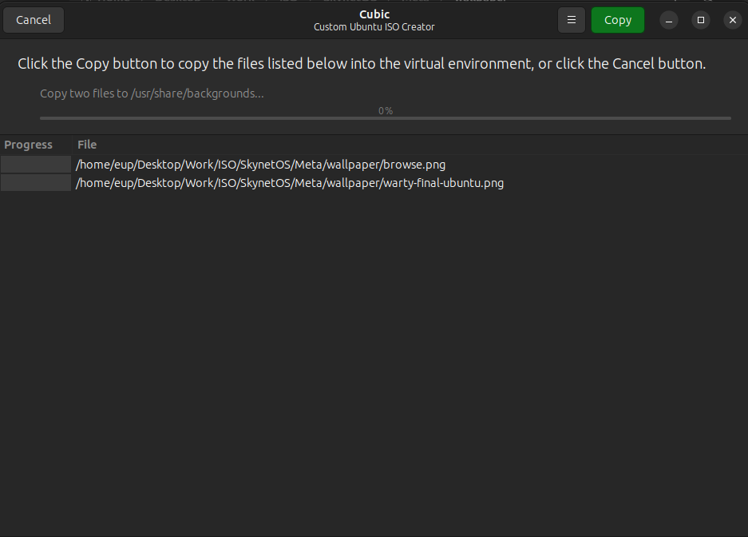
    
    3. Copy the **wallpaper** and **browse.png** on some other locations
         ```bash
            cp warty-final-ubuntu.png /usr/share/ubiquity-slideshow/slides/screenshots/welcome.png
            cp warty-final-ubuntu.png /usr/share/ubiquity-slideshow/slides/link/background.png
            mv browse.png /usr/share/ubiquity-slideshow/slides/screenshots/browse.png
         ```
13. Upload Custom Linux Logo e.g., **SkynetOS logo**
    1.  Make sure you already have a Logo available by name **ubuntu-logo.png**
    2.  Make sure the **size** of logo is small/suitable
         ```bash
            # On Cubic Terminal
            cd /usr/share/plymouth/
            mv ubuntu-logo.png ubuntu-logo_default.png
         ```
    3. Upload Logo
       1. Click on Copy icon on Top Left, just after the BACK button.
       2. Select **ubuntu-logo.png**
       3. Click on Copy button on Top Right
      
            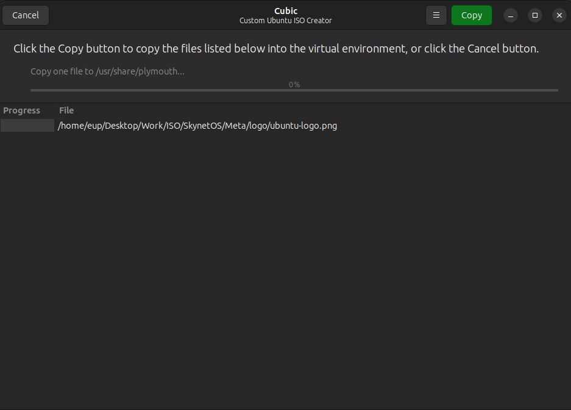
      
            ```bash
               cp ubuntu-logo.png /usr/share/plymouth/themes/spinner/watermark.png
            ```
14. Replace Ubuntu with **Skynet** in several files with these commands
    ```bash
      cd /usr/share/plymouth/

      for file_path in `find . -name "*.plymouth"`; do \
         echo "Updating file ${file_path}."; \
         sed -i "s|Ubuntu|Skynet|g" "${file_path}"; \
      done
    ```

## Upload Python Script

1. You can place your python script in **/usr/local/src/**
   ```bash
   cd /usr/local/src/
   ```
2. Click on Copy icon on Top Left, just after the BACK button.

3. Select two files
   1. **main.py**
   2. **startup.sh**

   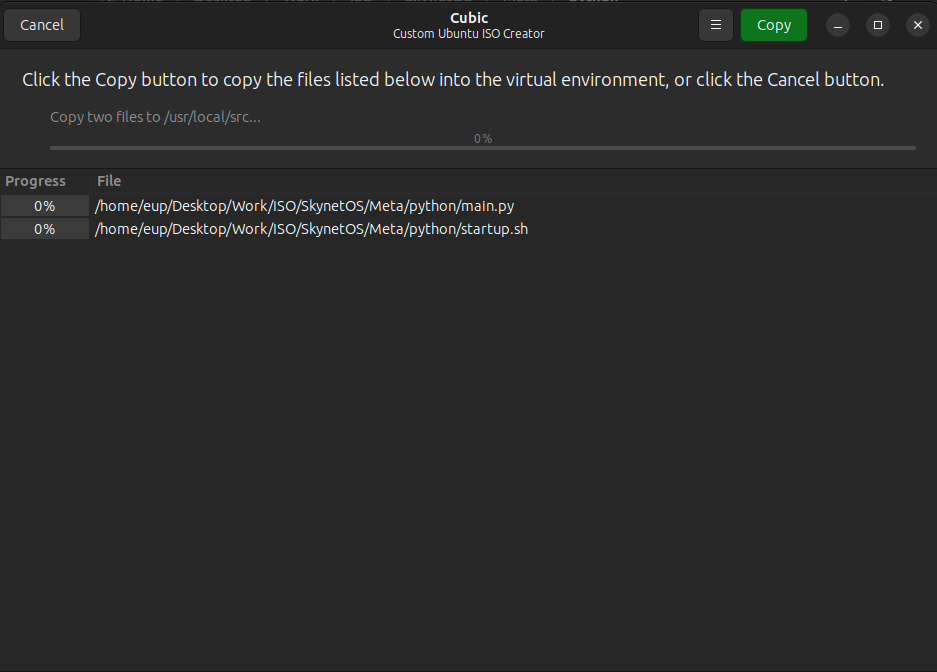

4. Click on Copy button on Top Right

5. Add python script i.e., startup.sh to cronjob

   ```bash
   crontab -e
   ```
   Select nano as a text editor

   At the end of line, add this line
   ```bash
   @reboot sleep 10; /usr/local/src/startup.sh &
   ```

6. Click Next button on Right Top

7. Wait for loading

   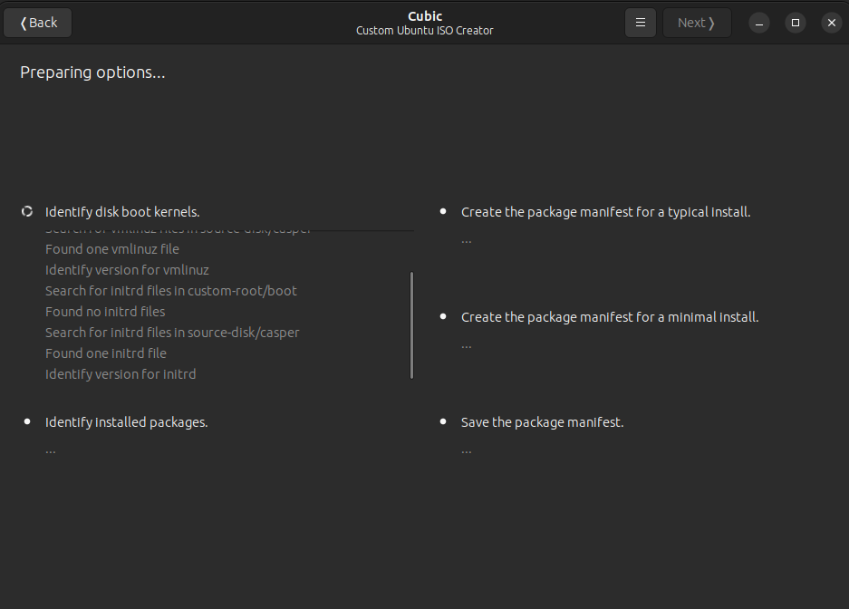


8. Select **gnome-initial-setup** and Click Next button on Right Top

   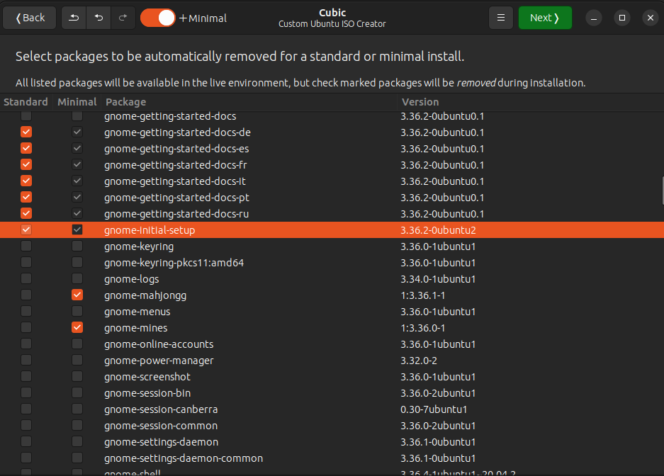

9. Click Next button on Right Top

   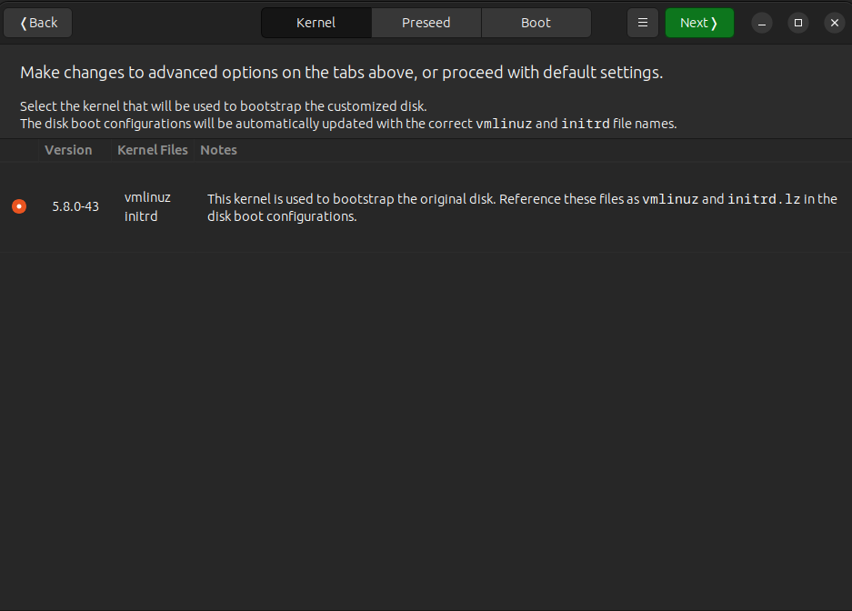

10. Click Generate button on Right Top
    
      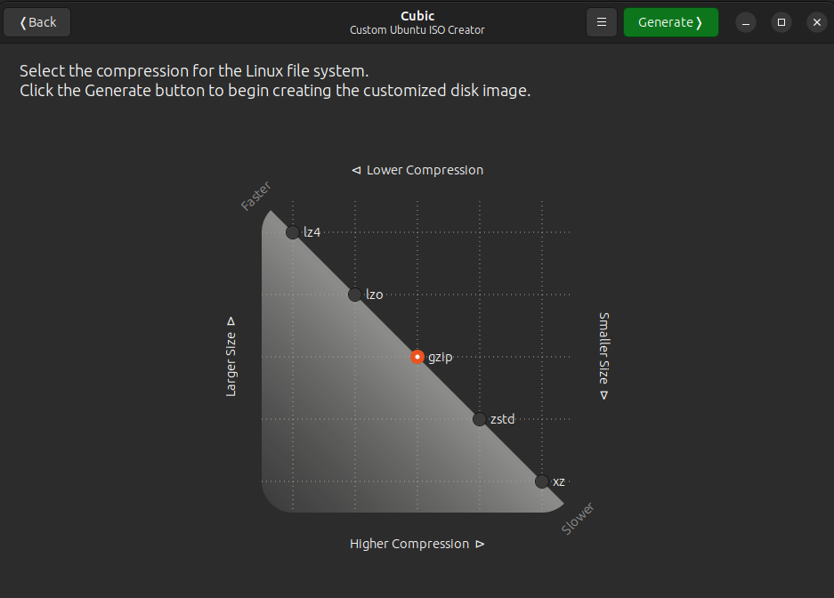

      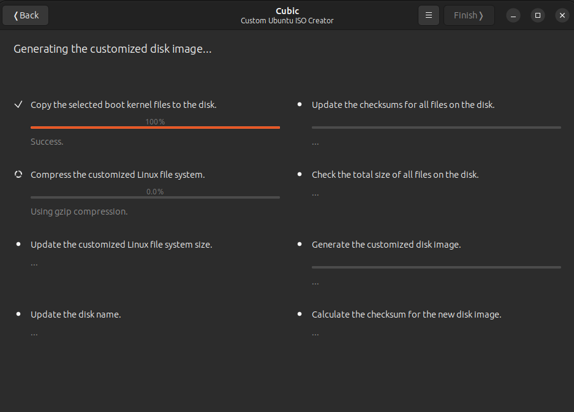

      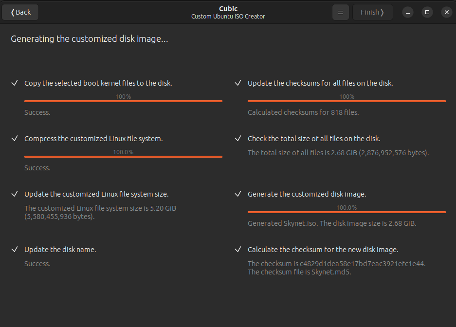

11. Wait for ISO creation

12. Make Sure to check: **Delete all files** at the bottom

      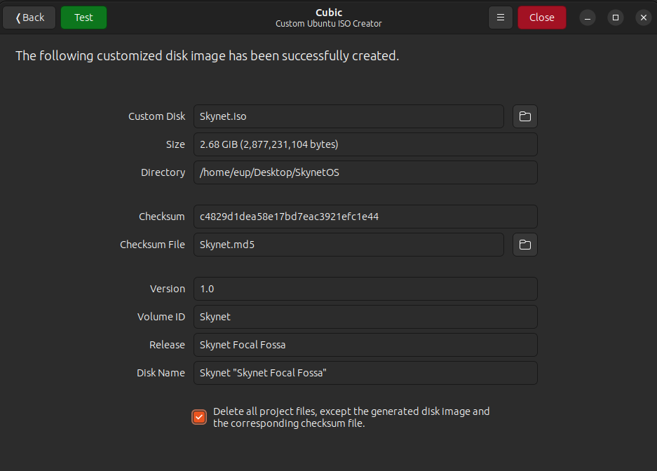

13. Close Cubic

Your custom **SkynetOS.iso** is ready in **Desktop/SkynetOS/SkynetOS.iso**

## Install SkynetOS

1. Install OS just like Ubuntu installation
2. You will notice following new features during installation
   1. New **Wallpaper**
   2. New **Logo**
   3. New **Images**
   4. Ubuntu will be replaced by **Skynet** everywhere

      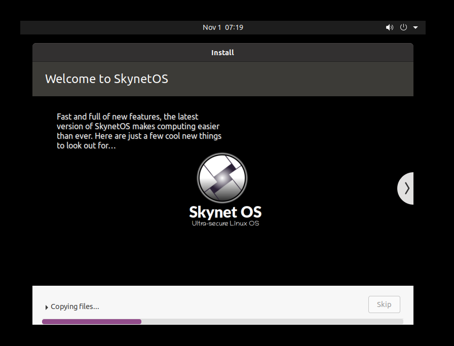
   
## Boot into SkynetOS

1. Welcome to **SkynetOS** with a new **Logo** and **Wallpaper**

   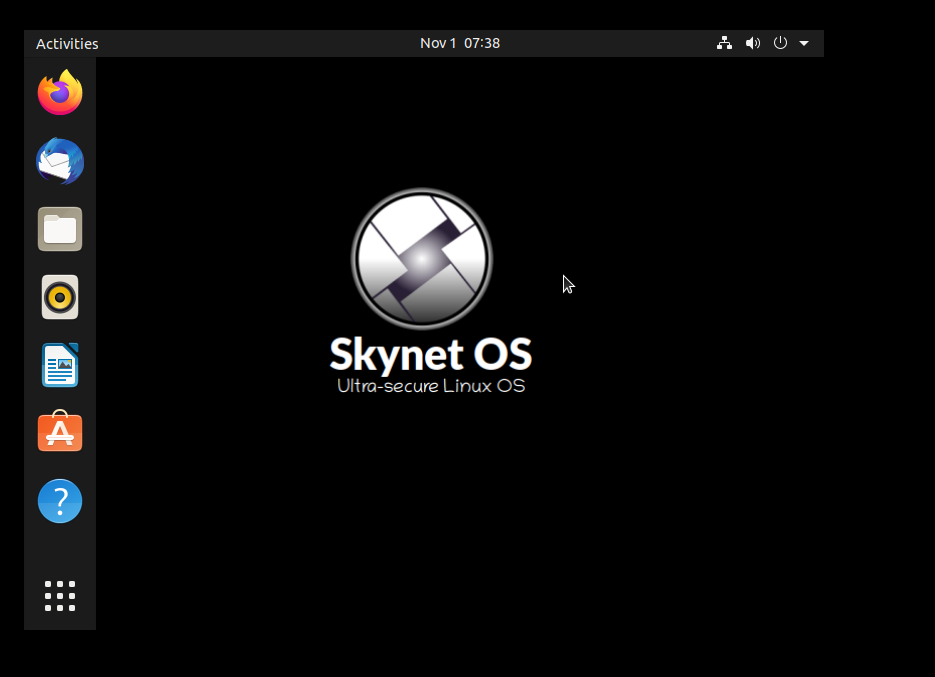
   
2. Launch terminal and test packages
   
   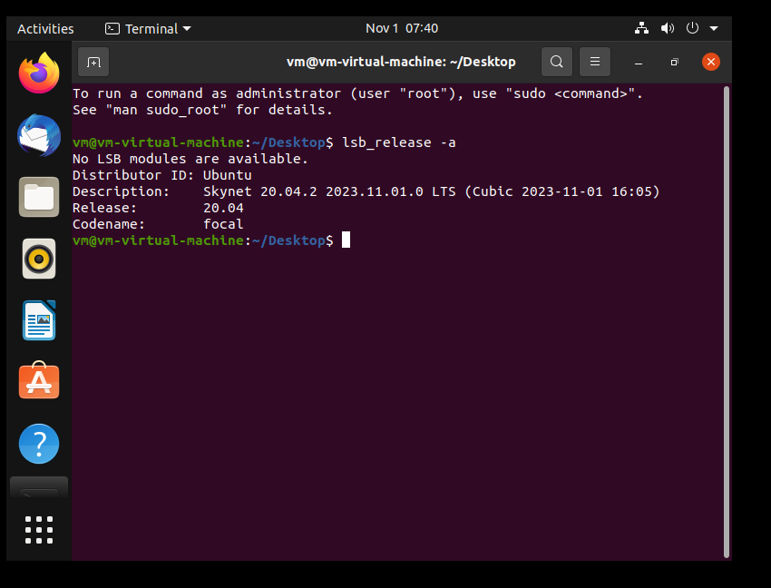

   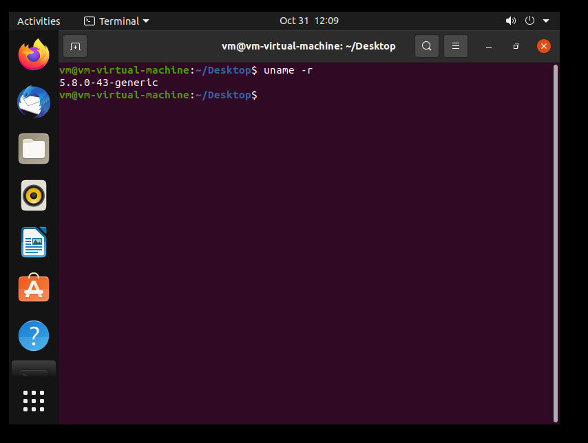
   
   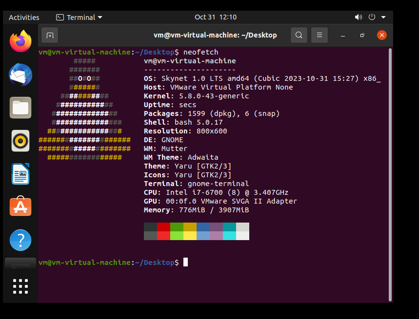
   
   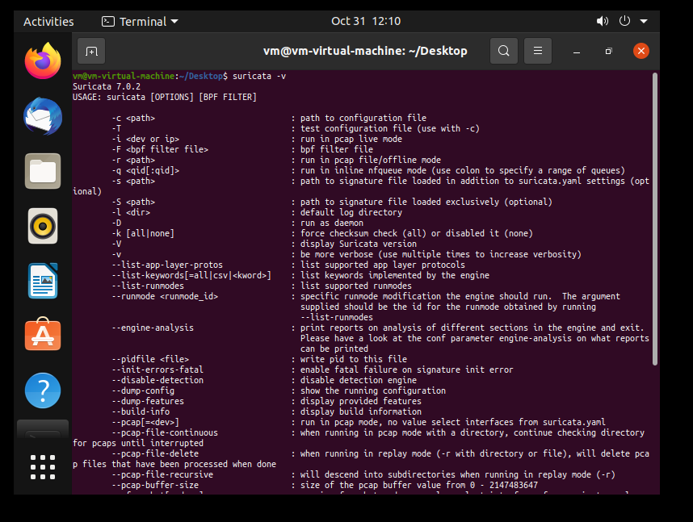

## Python Development

1. Python script is running in the background **screen**
2. Use this command open the background screen
   ```bash
   sudo screen -r startupPython
   ```
   You will see **Hello World!** printing infinitely

3. For development:
   ```bash
   cd /usr/local/src/main.py
   ```

## Happy Coding :)